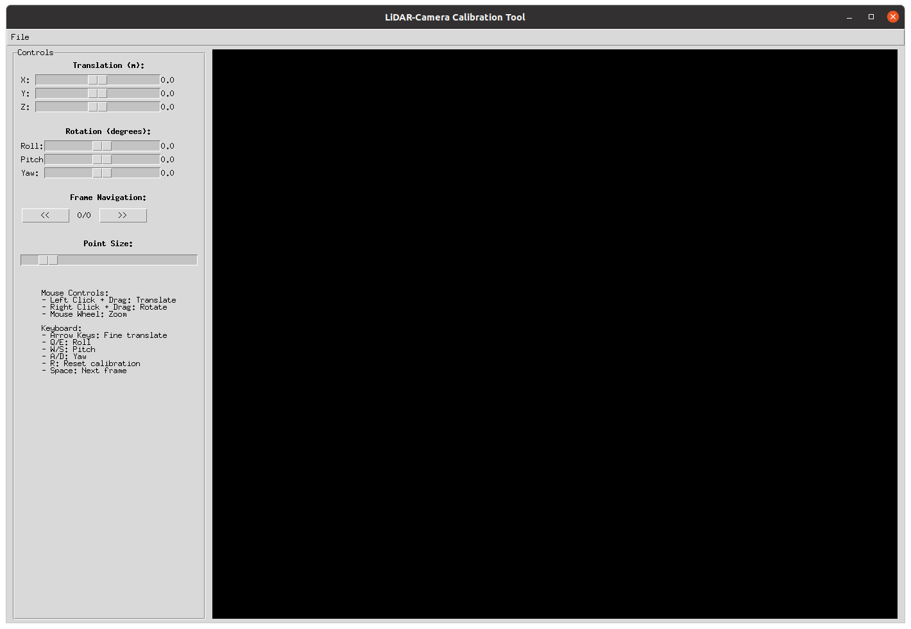
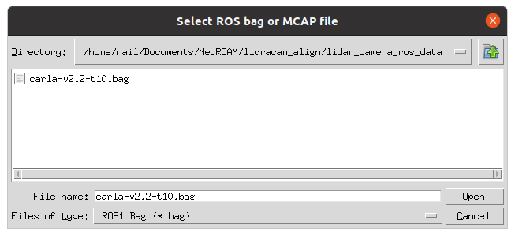
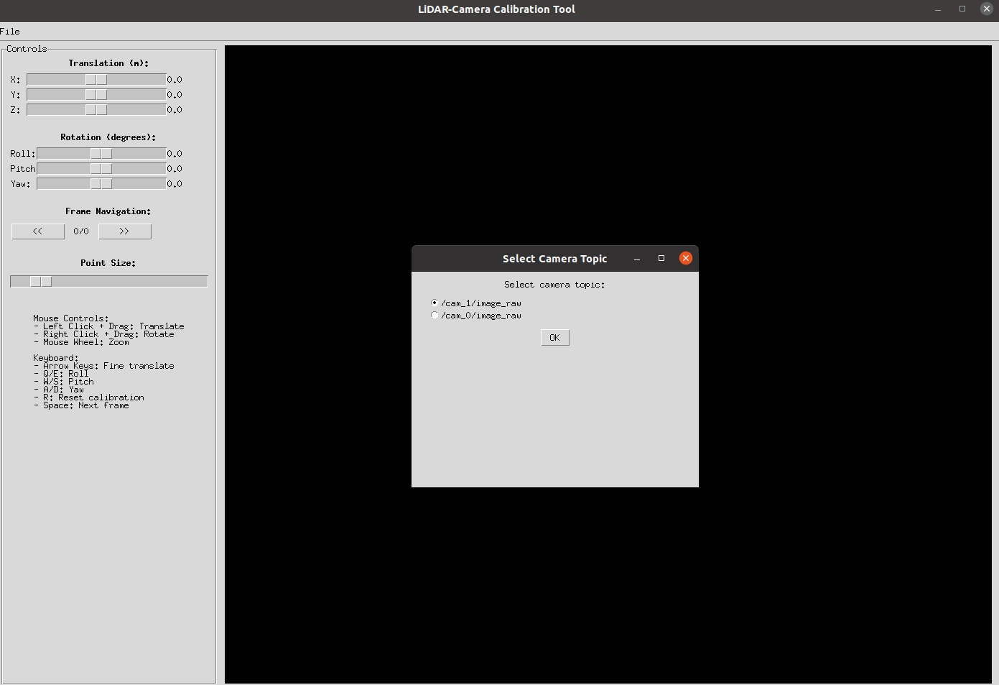
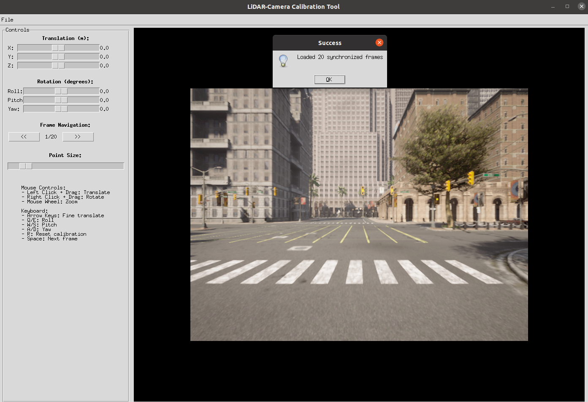
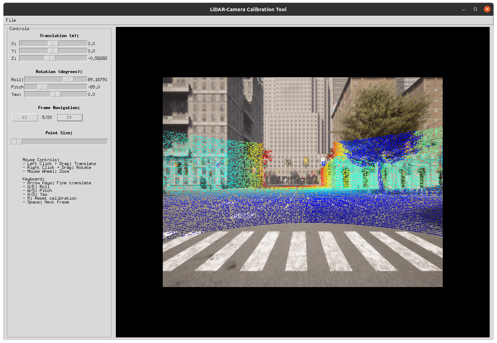
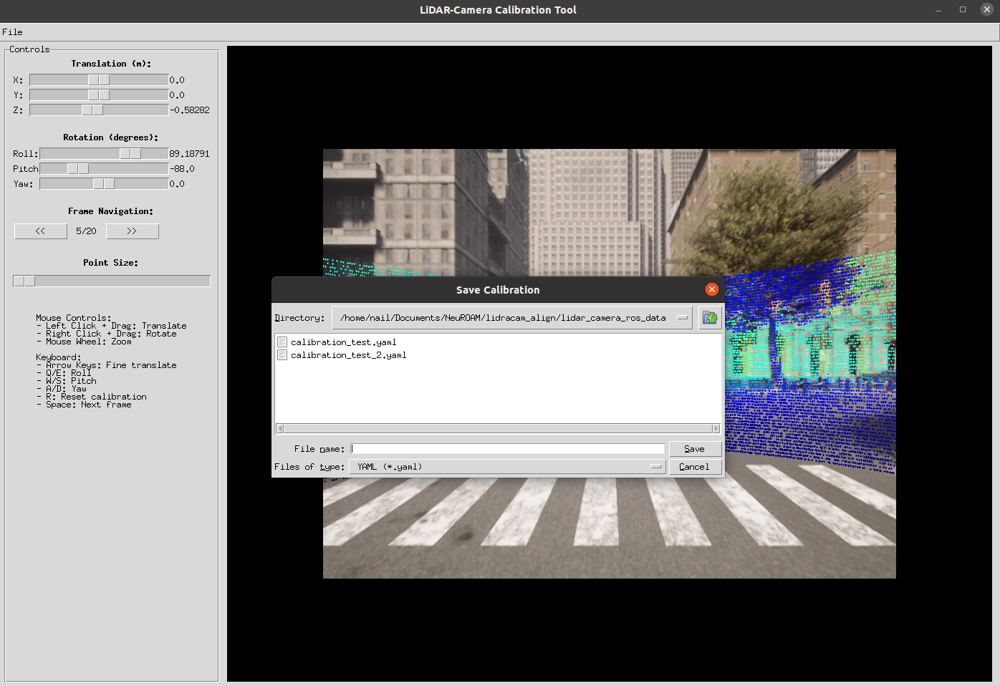

# LiDAR-Camera Calibration GUI

A simple and efficient GUI tool for manual alignment of camera frames and LiDAR point clouds from ROS/MCAP files. This tool provides mouse-based manual alignment without complex algorithms, making it easy to calibrate your sensor setup.

## Features

- **Multi-format Support**: ROS1 (.bag), ROS2 (.db3), and MCAP (.mcap) files
- **Mouse-based Manual Alignment**: Intuitive drag-and-drop calibration
- **Real-time Visualization**: Live preview of point cloud overlay on camera images
- **No ROS Installation Required**: Works with fallback implementations
- **Export Calibration Parameters**: Save results in JSON or YAML format
- **Simple and Efficient**: Minimal dependencies and clean interface

## Installation

### Prerequisites

- Python 3.7+
- OpenCV
- NumPy
- Tkinter (usually included with Python)

### Quick Install

1. **Clone the repository:**
   ```bash
   git clone https://github.com/neufieldrobotics/NeuROAM/tree/lidracam
   git checkout lidracam
   cd lidracam_align
   ```

2. **Install dependencies:**
   ```bash
   pip install opencv-python numpy pillow
   
   # For MCAP support (recommended):
   pip install mcap mcap-ros1-support mcap-ros2-support
   
   # For enhanced ROS bag support:
   pip install bagpy
   ```

3. **Run the GUI:**
   ```bash
   python calibration_gui.py
   ```

### Conda Environment (Recommended)

```bash
# Create a new conda environment
conda create -n lidarcam python=3.10
conda activate lidarcam

# Install dependencies
pip install opencv-python numpy pillow mcap mcap-ros1-support mcap-ros2-support bagpy

# Run the tool
python calibration_gui.py
```

## Usage

### 1. Launch the GUI



Run the calibration tool:
```bash
python calibration_gui.py
```

### 2. Load Your Data



Click "Load Bag" and select your ROS bag file (.bag), ROS2 bag (.db3), or MCAP file (.mcap). The tool will automatically:
- **Detect the file format** (ROS1, ROS2, or MCAP)
- **Scan for available topics** (camera images, LiDAR point clouds, camera info)
- **Categorize topics** by type for easy selection

#### Automatic Topic Detection

The tool automatically detects and categorizes topics:
- **Camera topics**: Topics containing image data (e.g., `/cam_0/image_raw`, `/camera/image`)
- **LiDAR topics**: Topics containing point cloud data (e.g., `/ouster/points`, `/velodyne_points`)
- **Camera info topics**: Topics containing camera calibration data (e.g., `/cam_0/camera_info`)

#### Topic Selection Dialog



If multiple camera topics are detected, you'll see a selection dialog allowing you to choose which camera to use for calibration. The tool will automatically match the corresponding camera info topic.

#### MCAP Files and Metadata

**Important**: For MCAP files, ensure that the `metadata.yaml` file is present in the same directory as your MCAP file. This file contains essential topic information that enables the tool to:
- Identify available topics without reading the entire file
- Handle potentially corrupted or incomplete MCAP files
- Provide faster topic discovery

Example directory structure:
```
data/
├── your_data.mcap
└── metadata.yaml
```

### 3. Manual Alignment



Use the intuitive controls to align the LiDAR points with the camera image:

- **Mouse Controls:**
  - Left click + drag: Translate the point cloud
  - Right click + drag: Rotate the point cloud
  - Mouse wheel: Zoom in/out

- **Parameter Controls:**
  - Translation sliders: Fine-tune X, Y, Z translation
  - Rotation sliders: Adjust Roll, Pitch, Yaw angles
  - Point size: Change visualization point size

### 4. Real-time Preview



See the alignment results in real-time as you adjust parameters. The LiDAR points are color-coded by depth for better visualization.


### 5. Top-View Preview


See the top view alignment results in real-time as you adjust parameters. The LiDAR points get updated both in the camera view and top view to help in faster and easier alignement. The LiDAR points are color-coded the same in both views by depth for better visualization.

### 6. Save Calibration



Once satisfied with the alignment, click "Save Calibration" to export your results in JSON or YAML format.

## Output Format

The calibration tool outputs the following parameters:

### JSON Format
```json
{
  "rotation": [
    [0.99996192, -0.00872654, 0.00000000],
    [0.00872654, 0.99996192, 0.00000000],
    [0.00000000, 0.00000000, 1.00000000]
  ],
  "translation": [0.1, 0.05, 0.2],
  "camera_matrix": [
    [525.0, 0.0, 320.0],
    [0.0, 525.0, 240.0],
    [0.0, 0.0, 1.0]
  ],
  "dist_coeffs": [0.0, 0.0, 0.0, 0.0, 0.0],
  "image_width": 640,
  "image_height": 480
}
```

### YAML Format
```yaml
rotation:
- [0.99996192, -0.00872654, 0.00000000]
- [0.00872654, 0.99996192, 0.00000000]
- [0.00000000, 0.00000000, 1.00000000]
translation: [0.1, 0.05, 0.2]
camera_matrix:
- [525.0, 0.0, 320.0]
- [0.0, 525.0, 240.0]
- [0.0, 0.0, 1.0]
dist_coeffs: [0.0, 0.0, 0.0, 0.0, 0.0]
image_width: 640
image_height: 480

# Rotation matrix in readable format:
# [R1 R2 R3]
# [R4 R5 R6]
# [R7 R8 R9]
rotation_matrix_formatted: |
  [ 0.99996192 -0.00872654  0.00000000]
  [ 0.00872654  0.99996192  0.00000000]
  [ 0.00000000  0.00000000  1.00000000]

# Euler angles (degrees) [Roll, Pitch, Yaw]:
euler_angles_deg:
  roll: 0.000000
  pitch: 0.000000
  yaw: 0.500000
```

## Supported Data Formats

| Format | Extension | Description | Requirements |
|--------|-----------|-------------|-------------|
| ROS1 Bag | `.bag` | Standard ROS1 bag files | None |
| ROS2 Bag | `.db3` | ROS2 SQLite database format | None |
| MCAP | `.mcap` | Modern container format for robotics data | Requires `metadata.yaml` in same directory |

### MCAP File Requirements

For MCAP files, the tool requires a `metadata.yaml` file in the same directory. This file should contain:
- Topic names and message types
- Message counts and timing information
- Bag file metadata

Example `metadata.yaml` structure:
```yaml
rosbag2_bagfile_information:
  topics_with_message_count:
    - topic_metadata:
        name: /cam_0/image_raw
        type: sensor_msgs/msg/Image
      message_count: 1000
    - topic_metadata:
        name: /ouster/points
        type: sensor_msgs/msg/PointCloud2
      message_count: 500
```

## Troubleshooting

### Common Issues

1. **"No bag reading libraries found" error:**
   ```bash
   pip install mcap mcap-ros1-support mcap-ros2-support
   ```

2. **"ROS messages not available" warning:**
   - This is normal and expected. The tool uses fallback implementations.
   - The GUI will still work perfectly.

3. **File not visible in dialog:**
   - Make sure your file has the correct extension (.bag, .db3, .mcap)
   - Try selecting "All files (*.*)" in the file dialog

4. **GUI closes immediately:**
   - Check the terminal for error messages
   - Ensure all dependencies are installed

5. **"No camera/LiDAR topics found" error:**
   - Check that your bag file contains the expected message types
   - For MCAP files, ensure `metadata.yaml` is present and correctly formatted
   - Verify topic names match expected patterns (e.g., topics containing "image", "camera", "lidar", "points")

6. **MCAP file reading issues:**
   - Ensure `metadata.yaml` file is in the same directory as the MCAP file
   - Check that the MCAP file is not corrupted or incomplete
   - Try using a different MCAP file or re-export your data

7. **Topic selection dialog doesn't appear:**
   - This is normal when only one camera topic is detected
   - The tool automatically selects the single available camera topic
   - Multiple camera topics will trigger the selection dialog

### Performance Tips

- For large datasets, consider downsampling your point clouds before calibration
- MCAP format generally provides better performance than ROS bags (when properly formatted)
- Close other applications to ensure smooth real-time visualization
- For MCAP files, having `metadata.yaml` significantly improves loading performance
- If you have multiple camera topics, pre-select the one you want to use to avoid the selection dialog

## Sample Data

The repository includes sample data in the `lidar_camera_ros_data/` directory:
- `carla-v2.2-t10.bag` - Sample ROS bag file for testing

## Contributing

Contributions are welcome! Please feel free to submit issues, feature requests, or pull requests.


**Note**: This tool is designed for manual calibration. For automated calibration algorithms, consider using specialized robotics calibration packages.
